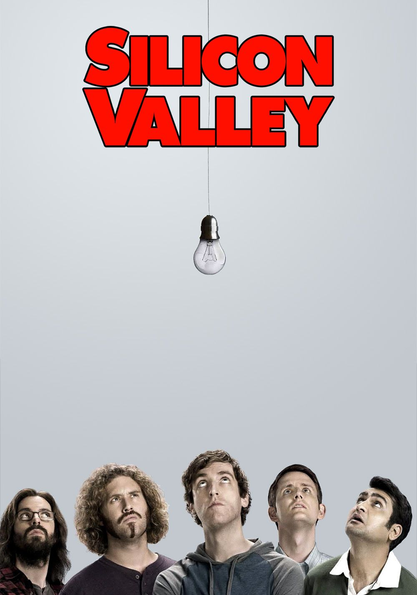

  

## About me

After 10 years in the French Army as a telecom specialist, I made a career switch into web development in 2022. Now I'm going deeper — studying low-level programming and Computer Science at Holberton School, while exploring cybersecurity, robotics, and electronics on the side.
## 🛠️ Tech Stack
Here's what I've worked with so far. New languages don't scare me — Rust is on the way.

    
Languages

    

    
    
    
    
    
    
    
    
    

    
Frameworks & Libraries

    

    
    
    
    

    
Databases

    

    
    
    

    
Tools

    

    
    
    
    
    
    
    
    
    
    
    

    
OS

    

    
    
    
    

## 🎮 Hobbies
The stack doesn't define me. But it helps.
## 📺 Favorite Shows

<table>
<tr>
  <td align="center" valign="top" width="20%">
    
     
    <a href="https://www.themoviedb.org/tv/62560-mr-robot">Mr. Robot</a>
  </td>
  <td align="center" valign="top" width="20%">
    
     
    <a href="https://www.themoviedb.org/tv/60573-silicon-valley">Silicon Valley</a>
  </td>
  <td align="center" valign="top" width="20%">
    
     
    <a href="https://www.themoviedb.org/tv/4087-the-x-files">The X-Files</a>
  </td>
  <td align="center" valign="top" width="20%">
    
     
    <a href="https://www.themoviedb.org/tv/93740-foundation">Foundation</a>
  </td>
  <td align="center" valign="top" width="20%">
    
     
    <a href="https://www.themoviedb.org/tv/86831-love-death-robots">Love, Death & Robots</a>
  </td>
</tr>
</table>

## 📡 On My Feed

<table>
<tr>
  <td align="center" valign="top" width="16%">
    
     
    <a href="https://www.youtube.com/@Underscore_">Underscore_</a>
  </td>
  <td align="center" valign="top" width="16%">
    
     
    <a href="https://www.youtube.com/@DefendIntelligence">Defend Intelligence</a>
  </td>
  <td align="center" valign="top" width="16%">
    
     
    <a href="https://www.youtube.com/@codetv-dev">CodeTV</a>
  </td>
  <td align="center" valign="top" width="16%">
    
     
    <a href="https://www.youtube.com/@NetworkChuck">NetworkChuck</a>
  </td>
  <td align="center" valign="top" width="16%">
    
     
    <a href="https://www.youtube.com/@fknight">Forrest Knight</a>
  </td>
  <td align="center" valign="top" width="16%">
    
     
    <a href="https://www.youtube.com/@typecraft_dev">TypeCraft</a>
  </td>
</tr>
</table>
